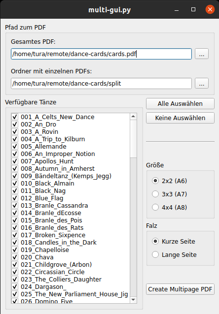

# Tanzkarten
## LaTeX Tanzkarten für Historische und davon inspirierte Tänze

### [Für Tanzkarten zum Ball in Wuppertal 2022 immer hier entlang](https://github.com/Phayax/dance-cards/blob/ball-2022/BALL.md)

## Download

[Tanzkarten A6 - Alle Tänze zusammen](https://github.com/Phayax/dance-cards/releases/latest/download/Tanzanleitungen.pdf)  
[Tanzkarten A6 - Ein Tanz pro PDF](https://github.com/Phayax/dance-cards/releases/latest/download/Tanzanleitungen-einzeln.zip)

## Druck
Die Karten können zum Beispiel mit Adobe Acrobat auf A4 Papier gedruckt werden (immer 4 auf eine Seite).   
Papier schwerer als 200g/m² liefert schöne Ergebnisse.  

Wenn man die Karten doppelseitig drucken möchte, muss man die richtigen Seiten "zueinander" legen, dies erfordert etwas mehr Aufwand. Dafür gibt es hier PDFs, bei denen die Seiten richtig für doppelseitigen Druck angeordnet wurden (jeweils einmal für Falz auf der "kurzen" und "langen" Blattkante).

##### Falz kurze Kante:
- [2x2 Tanzkarten auf A4- ergibt A6](https://github.com/Phayax/dance-cards/releases/latest/download/Tanzanleitungen_2x2_A6_kurze_Kante.pdf)
- [3x3 Tanzkarten auf A4- ergibt ~A7](https://github.com/Phayax/dance-cards/releases/latest/download/Tanzanleitungen_3x3_A7_kurze_Kante.pdf)
- [4x4 Tanzkarten auf A4- ergibt A8](https://github.com/Phayax/dance-cards/releases/latest/download/Tanzanleitungen_4x4_A8_kurze_Kante.pdf)

##### Falz lange Kante:
- [2x2 Tanzkarten auf A4- ergibt A6](https://github.com/Phayax/dance-cards/releases/latest/download/Tanzanleitungen_2x2_A6_lange_Kante.pdf)
- [3x3 Tanzkarten auf A4- ergibt ~A7](https://github.com/Phayax/dance-cards/releases/latest/download/Tanzanleitungen_3x3_A7_lange_Kante.pdf)
- [4x4 Tanzkarten auf A4- ergibt A8](https://github.com/Phayax/dance-cards/releases/latest/download/Tanzanleitungen_4x4_A8_lange_Kante.pdf)


Während die A6 Karten 0,5cm Rand haben, was die meisten Drucker gut schaffen müssten, wird der Rand bei den kleiner Formaten weniger als 0,5cm sein. Hier muss man eventuell die Seitengröße im PDF-Programm leicht anpassen.

## Eigene Tanzkarten erstellen
Klone das Repository mit Git um änderungen vorzunehmen:

```bash
mkdir ~/remote
cd ~/remote
git clone https://github.com/Phayax/dance-cards.git
```
Zum Verändern und Hinzufügen von Tänzen braucht man LaTeX, für das Setzen der Karten Python.

### LaTeX Installation - Tänze hinzufügen

Die Tänze sind in TeX Skript geschrieben. Empfohlene Software:

 - [TeXstudio](https://www.texstudio.org/) als Editor

 - [TeX Live](https://www.tug.org/texlive/) um die PDFs zu erstellen. 

 - Unter Windows kann man auch [MiKTeX ](https://miktex.org/) verwenden, das aber deutlich langsamer mit den Karten ist.

 - Ubuntu macht die Installation dieser Pakete sehr einfacher:
   ```bash
   sudo apt install texstudio
   sudo apt install texlive-full   # braucht viel Speicherplatz, aber man hat alles...
   ```

Nun kann man [`cards.tex`](https://github.com/Phayax/dance-cards/blob/main/cards.tex) in TeXstudio öffnen und beliebige Änderungen vornehmen.

Kompiliere die Tanzkarten mit

```bash
cd ~/remote/dance-cards
latexmk cards.tex
```

Wenn das Kommande erfolgreich durchläuft liegt das erstellte PDF in `cards.pdf`.

### Python Installation - Tanzkarten setzen

Die bereits fertig gesetzten Tanzkarten stehen oben zum Download zur Verfügung. Um nur ein paar der Tänze als PDF zu verpacken und die notwendigen Skripte zum setzen der Tanzkarten auszuführen braucht man mindestens Python 3.11.

```bash
python -V
```

Falls die Version zu niedrig ist, installiere so [Python](https://www.python.org/downloads/) 3.11

```bash
sudo add-apt-repository ppa:deadsnakes/ppa
sudo apt update
sudo apt install python3.11 python3.11-venv
```

Erstelle eine Python Umgebung 

```bash
mkdir ~/.venvs
python3.11 -m venv ~/.venvs/dance-cards
source ~/.venvs/dance-cards/bin/activate

python -V # sollte nun 3.11.xx anzeigen
pip --version # sollte auf das venv zeigen
```

Installiere die requirements

```bash
cd ~/remote/dance-cards
pip install -r requirements
```

Nun können die Skripte [split.py](https://github.com/Phayax/dance-cards/blob/main/split.py) und [multi-gui.py](https://github.com/Phayax/dance-cards/blob/main/multi-gui.py) ausgeführt werden.

### Karten kompilieren, splitten, zusammenfügen

Um das PDF zu erstellen empfiehlt sich latexmk. Dafür sollte [`.latexmkrc`](https://github.com/Phayax/dance-cards/blob/main/.latexmkrc) im selben Verzeichnis wie cards.tex liegen.

Kompiliere alle Tanzkarten. Siehe die `cards.pdf` Datei bei Erfolg.

````bash
cd ~/remote/dance-cards
latexmk cards.tex
````

Spalte die Karten in einzelne:

```bash
source ~/.venvs/dance-cards/bin/activate
python split.py
```

Kompiliere die einzelnen Karten:

```bash
cd split
latexmk *.tex
cd ..
```

Öffne die Tanzauswahl:

```bash
python multi-gui.py
```



* Wähle oben das gesamte PDF aus, dann den Ordner in dem die einzelnen Tänze liegen. 
  Nun sollten die `Verfügbaren Tänze` erscheinen. 
* Wähle rechts die gewünschte Kartengröße aus
* und ob das doppelseitige PDF beim Druck über die kurze oder lange Seite gedreht werden soll.
  Tip: `Kurze Seite` behält das PDF besser lesbar, `Lange Seite` ist die Standardeinstellung der meisten Drucker.
* Klicke auf `Create Multipage PDF`

Dies erschafft eine neue TeX Datei. Kompiliere ein 3x3 (A7) mit Falz zur kurzen Seite so:

```
latexmk multi_cards_3x3_fold_short_tex
```

Das gebaute `multi_cards_3x3_fold_short_.pdf` ist das Ergebnis.
